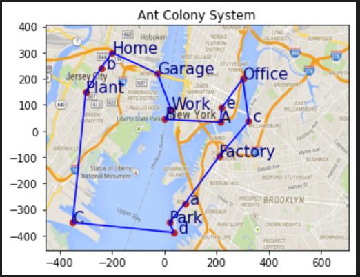

# Project Summary: Dynamic Travelling Salesman Problem (DTSP) via Ant Colony Optimization

## Page 1: Introduction and Problem Statement

### Introduction:
The problem of efficiently routing vehicles, known as the Travelling Salesman Problem (TSP), has been extensively studied in the field of operations research and optimization. Traditional TSP scenarios assume static data, where all information about the problem is known in advance. However, in real-world scenarios, data can be dynamic, with new orders or destinations emerging over time. This necessitates the development of algorithms capable of dynamically adapting to changes in the problem space.

### Problem Statement:
The Dynamic Travelling Salesman Problem (DTSP) involves finding the shortest route for a salesman who must visit a set of locations (nodes), where the data associated with these locations may change over time. The challenge is to develop an algorithm that can efficiently optimize routes in real-time as new nodes are added or existing nodes are modified.

## Page 2: Theory, Approach, Implementation, and Output

### Theory: Ant Colony Optimization (ACO)
Ant Colony Optimization is a metaheuristic inspired by the foraging behavior of ants. It is particularly well-suited for solving combinatorial optimization problems such as the TSP. In ACO, artificial ants construct solutions by iteratively selecting paths based on pheromone levels and heuristic information. Pheromones are then updated based on the quality of the solutions found, guiding subsequent iterations towards promising areas of the solution space.

### Approach:
The project proposes using Ant Colony Optimization to tackle the DTSP. The approach involves adapting the traditional ACO framework to handle dynamic data, where new nodes can be added to the problem space. To achieve this, the algorithm must be able to incorporate new nodes into existing routes without restarting the optimization process entirely. This requires careful management of pheromone trails and heuristic information to efficiently guide ants towards optimal solutions.

### Implementation:
The implementation consists of a Python program that encapsulates the ACO algorithm for solving the DTSP. The program utilizes object-oriented programming techniques, with classes representing ants, edges, and the overall optimization process. Key functionalities include:

- Reading data from a CSV file containing node coordinates and names.
- Initializing pheromone levels and heuristic information for edges.
- Dynamically updating pheromone trails and constructing tours based on the ACO framework.
- Incorporating new nodes into existing routes without restarting the optimization process.
- Plotting the optimized routes on a map for visualization and analysis.

### Output:

The output of the program includes the optimized route for the DTSP, along with the corresponding distance traveled. Additionally, the program saves the tour data to a CSV file, allowing for future reference or further analysis. Visualization of the optimized routes on a map provides insights into the efficiency of the algorithm and the quality of the solutions obtained.

## Conclusion:
The project demonstrates the effectiveness of Ant Colony Optimization for solving the Dynamic Travelling Salesman Problem. By adapting the ACO framework to handle dynamic data, the algorithm is capable of efficiently optimizing routes in real-time as new nodes are introduced. The implementation provides a practical solution for addressing the challenges posed by dynamic problem scenarios in vehicle routing and logistics applications.
